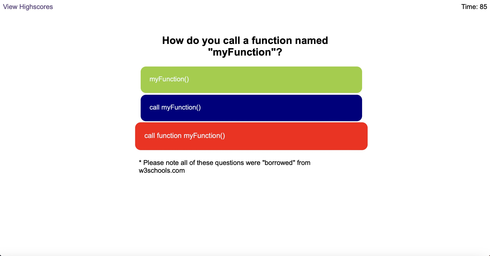

# js-quiz

## Goal

This week’s challenge was to build a timed coding quiz with multiple-choice questions. This app will run in the browser, and will feature dynamically updated HTML and CSS powered by JavaScript code that I write. It will have a clean, polished, and responsive user interface.

## Implementation

This was another fun little project. I've never used localStorage before so that was something new for me and I'm not entirely sure if it is implemented correctly. The object that's returned has already 6 other objects in it so when I looped over the localStorage to get results I omitted those 6 objects. I tested it a few times and it worked well but I'm not sure if it is always, under any circumstances, 6 other objects or something else is added/subtracted. If so then the results displayed will not be correct.\
I've obtained the questions and asnwers from w3schools.com by doing their own JS Fundamentals Quiz.\
I know from my own experience that JS file can very quickly get pretty messy so I tried to keep it as simple as possible and comment functions so it's clear what's going on.

site can be found here: https://michalous.github.io/js-quiz